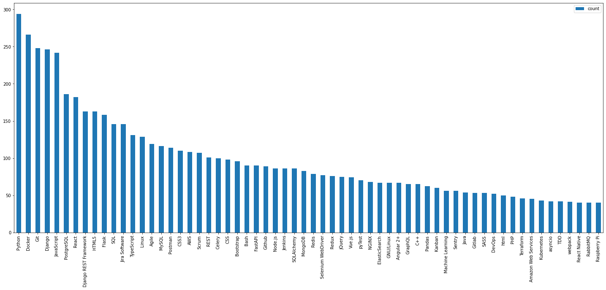
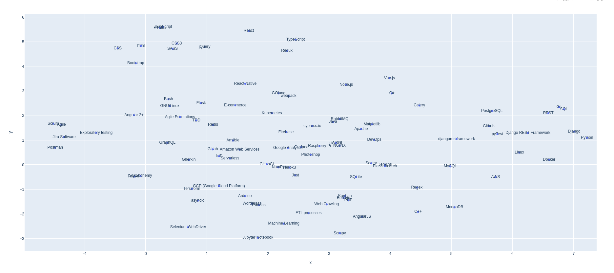
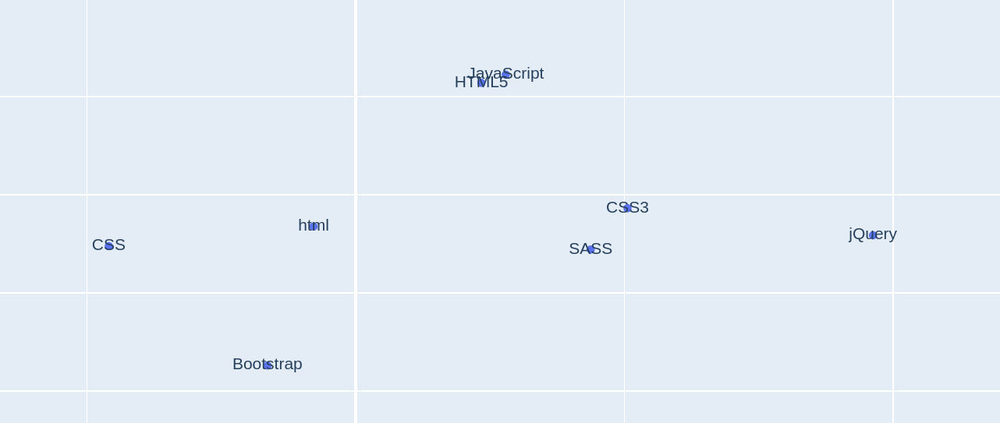
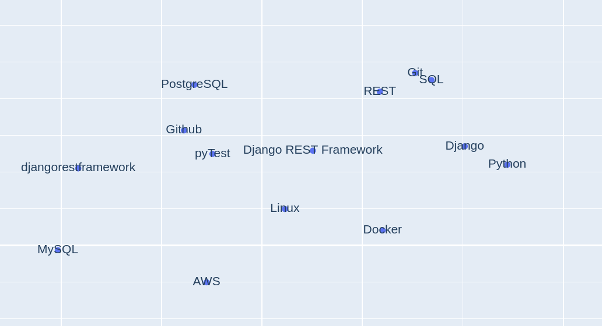
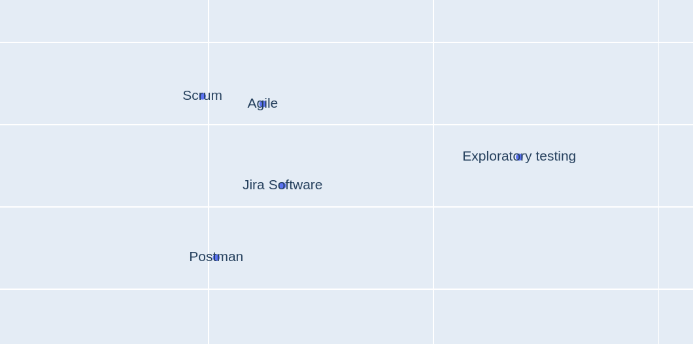

# SXI-Tech-Recommender
The general idea is to build a recommendation system which will recommend a technologies 
which can be known by a specific person. 

**The example:**

*Person A is a backend developer, he can use Python, Flask, Django then it is most
likely that he can use also MySQL or FastAPI.*

All the mentioned technologies should be classified as similar as they are a web development
abilities.

The study was divided for 5 parts which were implemented in a separated files.

## 1. Data preprocessing:
*demo/1_data_preprocessing.py*

Data is json file located in *data/* directory with information about people and which technologies they are able to use.

I loaded the file to a *pandas.DataFrame* object, then I have a sparse matrix:

|                  | Technology 1 (Python)                | Technology 2 (React) | Technology (3) (Django) |
|------------------|--------------------------------------|----------------------|-------------------------|
| Person 1         | A level person 1 knows technology 1  | 5                    | null                    |
| Person 2         | 1                                    | null                 | 1                       |
| Person 3         | 2                                    | null                 | 2                       | 

The level of each technology is an integer number from 1 (basic) to 5 (high experience).
 I save the matrix into .*csv* file.

## 2. Data exploration:
*2_data_exploration_frames.py*  
*3_data_exploration_charts.ipynb*  

I made the following observations:
* Found most rare technologies which have over 400 null values.  
* Spot the top used technologies,
* Check which persons have less than 10 powers.
* Count how many experienced backend/ frontend developers exist in data.
* Check the distribution of a Python / React knowledge.Most people have a Python level around 3 and React around 2.
* Check the count of each technology and mean.
* I compared the number of know technologies between frontend and backend developers.

Technologies with count >=40 build 20% of dataset.

## 3. Model Input
*4_data_preprocessing_surprise_model_powers_matrix.py*

To prepare data for the model I processed data for a pair of points:

|     | Technology | Name     | Level |
|-----|------------|----------|-------|
| 0   | Docker     | Person 1 | 1     |
| 1   | Git        | Person 1 | 1     |
| 2   | Html       | Person 2 | 2     | 

The each point from a matrix creates one row. 
One person can be in multiple rows, each row means that the person knows 
a technology on (1-5) level.

I save it to *.csv* file.

## 4. Model Implementation
*5_demo_surprise_model_implementation.py*

* I experiment with dropping some technologies, f.e. which occurs less than threshold=20.
* I use Grid search for a parameter search: number of epochs, learning rate and regularization term.
* In the final model I used the parameters which gave me the best RMSE score.

I tested how my algorithm works by forecasting how good the person who I know
is the backend/ frontend developer knows:
Python, Docker, Machine learning, React.

I cross validate using RMSE measure the following algorithms:
   * SVD,
   * SVDpp,
   * SlopeOne,
   * NMF,
   * NormalPredictor,
   * KNNBaseline,
   * KNNBasic,
   * KNNWithMeans,
   * KNNWithZScore,
   * BaselineOnly,
   * CoClustering

The most accurate algorithms were SVDpp and SVD. I spotted the difference between 
them by regenerating the following picture: the SVDpp points were more close to each other.

I build a technologies embedding, project it and visualize.

Some technologies may be generally popular among a wide range of audiences
and thus correspond to point in the center of this scatter plot.
Other powers may fall into very specific persons such as Product Owner or CEO. 
These powers may correspond to point away from the center of the plot.

I spot that some similar technologies are close to each other: 
  * Frontend technologies: **HTML5, CSS3, React, JavaScript.**

  * Backend technologies: **Django, REST, PostgreSQL, SQL.**
  
  * Product owner abilities: **Agile, Exploratory Testing, Jira, Scrum.**

This can be a good indicator how well the model understand which technologies are similar.